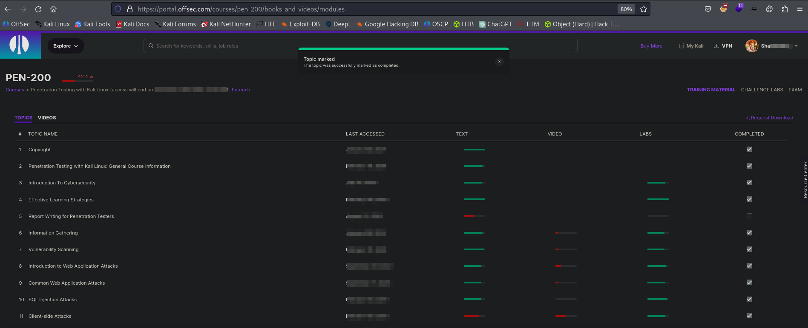

Greetings, pal! I'm Shaanks, holder of a Master's Degree in EPITA (Computer Engineer School) with 3 years of "alternance" (alternating half time school-company - french system), and I'm eager to recount my experiences with you. 
Here's the lowdown: This marks the inception of my inaugural blog, and I'm delighted to commence it with the narrative of my triumphant journey through the OSCP (Offensive Security Certified Professional) certification. 

I've been immersing myself in the captivating realm of cybersecurity solo for approximately some years. And the thrilling part? I (will) conquered the OSCP, so why don't write my rush board ?

A Journey of Cyber-Excitement 🤪 >>

Let me tell you, the OSCP exam isn't a leisurely stroll in the tech park; it's more like a roller coaster in the land of hackers, filled with twists and turns involving breaking into systems and assuming the role of a digital hero. While some may take an eternity to prepare, I opted to expedite my journey.\
- Note that OSCP is not necessarily web to get your first foothold, as there is (perhaps) some buffer over flow (BOF).\
*this certification isn't the easiest, but it's ***not the hardest*** either*

# Back to the Educational Arena:

I initiated my expedition by enrolling in an official course provided by Offensive Security (https://www.twitch.tv/offsecofficial) , the very architects of the OSCP exam. \
Their website, Offensive Security, became my primary reservoir of knowledge. 

This course served as my golden ticket, unlocking the enigmas of the exam. It laid the crucial foundation and furnished me with the fundamental knowledge essential to tackle the more intricate challenges that lay ahead.

# What's Included with Registration:

Upon enrolling in the course, you will gain access to the comprehensive OSCP study materials and a 3-month lab subscription. This package encompasses downloadable resources like videos and PDFs for your learning and future reference.

The labs consist of 6 machines; in my perspective, 3 of them pose a greater challenge than the OSCP exam, while the remaining 3 closely mirror the exam's configuration, albeit with slightly distinct methodologies.

# Exam Structure and Strategy : 

The exam structure is as follows:

To succeed in the OSCP exam, you must navigate through a structured evaluation. The exam comprises one Active Directory Domain, accounting for 40 points, and three standalone machines, each carrying a value of 20 points. \
Within these machines, 10 points are allocated for the low privilege 'local.txt' and an additional 10 points for the root/Administrator 'proof.txt'. To meet the passing criteria, your main objective is to successfully conquer the Active Directory and at least one standalone machine, thereby earning an additional 10 Bonus Points.

# Resources Utilized:

(Currently) I invested in a Hack The Box VIP membership and successfully tackled approximately 30 machines—3 Windows and 27 Linux. \
Whenever I encountered challenges in solving a specific machine, I sought guidance from IppSec's walkthrough videos. \
Even after independently solving a machine, I made it a routine to watch IppSec's demonstrations and explanations, enhancing my comprehension and acquiring new methodologies. \
Regularly integrating IppSec's walkthrough videos into my routine, I chose to utilize my pre-sleep time for educational purposes, opting for valuable insights and knowledge from IppSec's machine-solving sessions instead of scrolling through TikTok or consuming less educational content.

### Essential Resources for Success:

- OSCP Material and Challenge Labs (logic..) 

- HACK THE BOX\
*HTB's medium machines are about the same level as OSCP, sometimes even harder.*

- IPPSEC

#### My Exam Toolkit:

Prior to the exam, I configured a new Kali Linux virtual machine, installing all the necessary tools anticipated for the exam (Later i'ld like to configure my own pentest environnement from a Mac OS for exemple of Ubuntu). 

This toolkit included utilities like Ligolo (You can find my explanation of the Ligolo tool above), \
Impacket tools (Mandatory for Windows environnment), \
Autorecon (thx Tib3rius) \
Mimikatz, and others. As a precaution, I captured a screenshot of my setup, ensuring readiness in case any issues arose with the VM during the exam.

#### Ligolo-ng:

Before delving back into the blog, let's take a moment to discuss Ligolo. Ligolo is an invaluable tool for pivoting and tunneling, streamlining the process by creating a tunnel similar to a VPN. With Ligolo, ther there's no need for additional tools like proxy chains to perform attacks on the target. \
Its simplicity and effectiveness proved to be immensely helpful during my exam, and I'm confident it can be of assistance to you as well. \
I plan to create a comprehensive demonstration on effectively using Ligolo, showcasing not just double, but triple and even quadruple pivoting with it.

https://github.com/nicocha30/ligolo-ng

John Hammond :https://www.youtube.com/watch?v=qou7shRlX_s 

# Perseverance:

Now, let's address the most crucial aspect: perseverance. It's imperative that you never, and I mean never, give up—before, during, or even after the exam, regardless of the outcome. The OSCP exam itself may not be inherently difficult, and what often leads to people failing is not the exam's complexity but rather their mindset and psychological preparedness. Success hinges on how you approach and maintain determination throughout the exam.

# The Exam Day:

Im not yet but hope soon !

# The result

Result & feel + tips at at exam day (sleep, eat, ect)

# What's next ?

(next certification goal / next target)